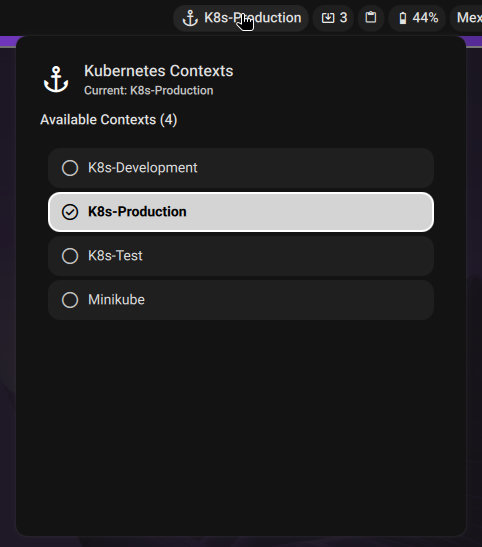

# Kubernetes Plugin for DMS

A plugin that displays the current Kubernetes context in the DMS bar with the ability to switch between contexts.



## Features

- **Display current kubectl context** in the DankBar
- **Quick context switching** via popup menu
- **Configurable refresh interval** (default: 300 seconds)
- **Custom kubeconfig path** support (default: ~/.kube/config)
- **Auto-close popup** after context selection
- **Visual indicators** for active context

## Installation

```bash
mkdir -p ~/.config/DankMaterialShell/plugins/
git clone https://github.com/psyreactor/dms-kubernetes.git kubernetes
```

## Usage

1. Open DMS Settings <kbd>Super + ,</kbd>
2. Go to the "Plugins" tab
3. Enable the "Kubernetes" plugin
4. Configure settings if needed (kubeconfig path, refresh interval)
5. Add the "kubernetes" widget to your DankBar configuration

## Configuration

### Settings

- **Kubeconfig Path**: Path to your Kubernetes config file (default: `~/.kube/config`)
- **Refresh Interval**: How often to refresh the current context in seconds (default: 300, range: 30-600)

### Widget Display

The widget shows:
- **Bar**: Anchor icon ⚓ + current context name
- **Popup**: List of all available contexts with the ability to switch by clicking

## Files

- `plugin.json` - Plugin manifest and metadata
- `KubernetesWidget.qml` - Main widget component
- `KubernetesSettings.qml` - Settings interface
- `README.md` - This file

## Permissions

This plugin requires:
- `settings_read` - To read plugin configurations
- `settings_write` - To save plugin configurations

## Requirements

- `kubectl` command-line tool must be installed and accessible in PATH
- Valid kubeconfig file at the configured path

## How It Works

The plugin uses `kubectl` commands to:
1. Get the current context: `kubectl config current-context`
2. List all contexts: `kubectl config get-contexts -o name`
3. Switch contexts: `kubectl config use-context <context-name>`

All commands respect the configured kubeconfig path.
