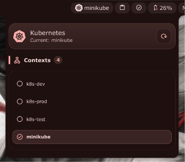

# Kubernetes Plugin for DMS

A plugin that displays the current Kubernetes context in the DMS bar with the ability to switch between contexts.



## Features

- **Display current kubectl context** in the DankBar
- **Quick context switching** via popup menu
- **Opens on the active context**: the list is scrolled to whichever context is
  current, rather than starting at the top
- **Context filter** appears automatically past 8 contexts. It takes keyboard
  focus when the popup opens, so you can type straight away:
  <kbd>Enter</kbd> switches to the first match, <kbd>Esc</kbd> clears the filter
  and then closes the popup
- **Scrollable list** with its own scrollbar past five contexts
- **Header card** showing the active context, the number of contexts and when
  they were last read
- **Manual refresh** with a spinner that tracks the actual `kubectl` call, and a
  toast when it completes
- **Configurable refresh interval**
- **Custom kubeconfig path** support (default: ~/.kube/config)
- **Auto-close popup** after context selection
- **Visual indicators** for active context
- **Compact mode**: hide the context name and reveal it in a tooltip on hover

## Installation

```bash
mkdir -p ~/.config/DankMaterialShell/plugins/
git clone https://github.com/psyreactor/dms-kubernetes.git kubernetes
```

## Usage

1. Open DMS Settings <kbd>Super + ,</kbd>
2. Go to the "Plugins" tab
3. Enable the "Kubernetes" plugin
4. Configure settings if needed (kubeconfig path, refresh interval)
5. Add the "kubernetes" widget to your DankBar configuration

## Configuration

### Settings

- **Kubeconfig Path**: Path to your Kubernetes config file (default: `~/.kube/config`)
- **Refresh Interval**: How often to re-read the kubeconfig, in seconds (range: 10-600, default: 15)
- **Hide cluster name**: Show only the icon in the bar and reveal the context name in a tooltip on hover (default: off)
- **Time Format**: How the last-updated time is rendered in the popup header —
  system default, 12-hour or 24-hour (default: system)

### Widget Display

The widget shows:
- **Bar**: Kubernetes logo + current context name. On a vertical bar only the
  logo is drawn, with the context name on hover.
- **Popup**: a header card with the active context, the context count and the
  last-updated time, then the list of available contexts. Clicking one switches
  to it and closes the popup; the active one is marked and not clickable.

## Files

- `plugin.json` - Plugin manifest and metadata
- `KubernetesWidget.qml` - Main widget component
- `KubernetesSettings.qml` - Settings interface
- `README.md` - This file

## Permissions

This plugin requires:
- `settings_read` - To read plugin configurations
- `settings_write` - To save plugin configurations

## Requirements

- `kubectl` command-line tool must be installed and accessible in PATH
- Valid kubeconfig file at the configured path

## How It Works

The plugin uses `kubectl` commands to:
1. Read the active context and the full context list in one call:
   `kubectl config view -o json`
2. Switch contexts: `kubectl config use-context <context-name>`

All commands respect the configured kubeconfig path.

Nothing is read from the clusters themselves — only the kubeconfig file — so the
widget works whether or not the clusters are reachable.
